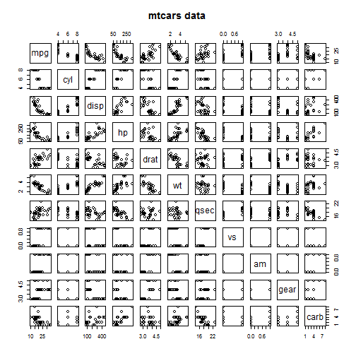
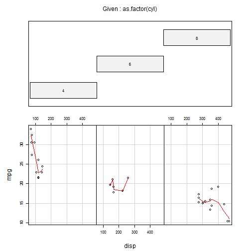

Motor Trend Car Road Tests dataset exploratory analysis
========================================================
transition:linear
author: Jurijs Jefimovs
date: 12/17/2014

Dataset description
========================================================
transition:linear

- The data was extracted from the 1974 Motor Trend US magazine, and comprises fuel consumption and 10 aspects of automobile design and performance for 32 automobiles (1973-74 models).

- Usage: mtcars

- Format. A data frame with 32 observations on 11 variables.

Variables description
========================================================
transition:linear
- mpg - Miles/(US) gallon
- cyl - Number of cylinders
- disp - Displacement (cu.in.)
- hp - Gross horsepower
- drat - Rear axle ratio
- wt - Weight (lb/1000)
- qsec - 1/4 mile time
- vs - V/S
- am - Transmission (0 = automatic, 1 = manual)
- gear - Number of forward gears
- carb - Number of carburetors

Data summary
========================================================
transition:linear


```
      mpg            cyl            disp             hp       
 Min.   :10.4   Min.   :4.00   Min.   : 71.1   Min.   : 52.0  
 1st Qu.:15.4   1st Qu.:4.00   1st Qu.:120.8   1st Qu.: 96.5  
 Median :19.2   Median :6.00   Median :196.3   Median :123.0  
 Mean   :20.1   Mean   :6.19   Mean   :230.7   Mean   :146.7  
 3rd Qu.:22.8   3rd Qu.:8.00   3rd Qu.:326.0   3rd Qu.:180.0  
 Max.   :33.9   Max.   :8.00   Max.   :472.0   Max.   :335.0  
      drat            wt            qsec            vs       
 Min.   :2.76   Min.   :1.51   Min.   :14.5   Min.   :0.000  
 1st Qu.:3.08   1st Qu.:2.58   1st Qu.:16.9   1st Qu.:0.000  
 Median :3.69   Median :3.33   Median :17.7   Median :0.000  
 Mean   :3.60   Mean   :3.22   Mean   :17.8   Mean   :0.438  
 3rd Qu.:3.92   3rd Qu.:3.61   3rd Qu.:18.9   3rd Qu.:1.000  
 Max.   :4.93   Max.   :5.42   Max.   :22.9   Max.   :1.000  
       am             gear           carb     
 Min.   :0.000   Min.   :3.00   Min.   :1.00  
 1st Qu.:0.000   1st Qu.:3.00   1st Qu.:2.00  
 Median :0.000   Median :4.00   Median :2.00  
 Mean   :0.406   Mean   :3.69   Mean   :2.81  
 3rd Qu.:1.000   3rd Qu.:4.00   3rd Qu.:4.00  
 Max.   :1.000   Max.   :5.00   Max.   :8.00  
```

Pairs plot
========================================================
transition:linear

 

Linear Model
========================================================
transition:linear


```

Call:
lm(formula = mpg ~ ., data = mtcars)

Coefficients:
(Intercept)          cyl         disp           hp         drat  
    12.3034      -0.1114       0.0133      -0.0215       0.7871  
         wt         qsec           vs           am         gear  
    -3.7153       0.8210       0.3178       2.5202       0.6554  
       carb  
    -0.1994  
```

ANOVA
========================================================
transition:linear
Analysis of variance (or deviance) tables for fitted model.

```
Analysis of Variance Table

Response: mpg
          Df Sum Sq Mean Sq F value Pr(>F)    
cyl        1    818     818  116.42  5e-10 ***
disp       1     38      38    5.35 0.0309 *  
hp         1      9       9    1.33 0.2610    
drat       1     16      16    2.34 0.1406    
wt         1     77      77   11.03 0.0032 ** 
qsec       1      4       4    0.56 0.4617    
vs         1      0       0    0.02 0.8932    
am         1     14      14    2.06 0.1659    
gear       1      1       1    0.14 0.7137    
carb       1      0       0    0.06 0.8122    
Residuals 21    147       7                   
---
Signif. codes:  0 '***' 0.001 '**' 0.01 '*' 0.05 '.' 0.1 ' ' 1
```

Conditioning plot
========================================================
transition:linear
Conditioning plot of miles per galon against displacement and number of cylindrs

 

Conclusion
========================================================
transition:linear
Based on anova test we might higlight 3 variables that realy has influence on cars consumption:
- Number of cylindrs (cyl)
- Displacement (disp)
- Weight (wt)

Transmission (am) variable was added for fun, but it also has some influence.
Thus 4 variable was chosen for Shiny app.

End
========================================================
transition:linear
Thank you!
